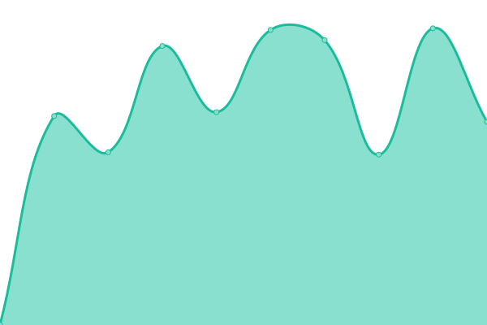

# [📈 Live Status](https://itglobal.github.io/upptime): <!--live status--> **🟩 All systems operational**

This repository contains the open-source uptime monitor and status page for [Upptime](https://upptime.js.org), powered by [Upptime](https://github.com/upptime/upptime).

<!--start: status pages-->
<!-- This summary is generated by Upptime (https://github.com/upptime/upptime) -->
<!-- Do not edit this manually, your changes will be overwritten -->
<!-- prettier-ignore -->
| URL | Status | History | Response Time | Uptime |
| --- | ------ | ------- | ------------- | ------ |
| [itglobal.ru](https://itglobal.ru) | 🟩 Up | [itglobal-ru.yml](https://github.com/ITGlobal/upptime/commits/master/history/itglobal-ru.yml) | 

 990ms
     
 | 

   

| [red-circule.com](https://red-circule.com) | 🟩 Up | [red-circule-com.yml](https://github.com/ITGlobal/upptime/commits/master/history/red-circule-com.yml) | 

 1682ms
     
 | 

   

| [test.red-circule.com](https://test.red-circule.com) | 🟩 Up | [test-red-circule-com.yml](https://github.com/ITGlobal/upptime/commits/master/history/test-red-circule-com.yml) | 

 2077ms
     
 | 

   

| [staging.red-circule.com](https://staging.red-circule.com) | 🟩 Up | [staging-red-circule-com.yml](https://github.com/ITGlobal/upptime/commits/master/history/staging-red-circule-com.yml) | 

 1919ms
     
 | 

   

<!--end: status pages-->

[**Status on Gitub Pages →**](https://itglobal.github.io/upptime)

## 📄 License

- Code: [MIT](./LICENSE) © [Upptime](https://upptime.js.org)
- Data in the `./history` directory: [Open Database License](https://opendatacommons.org/licenses/odbl/1-0/)
